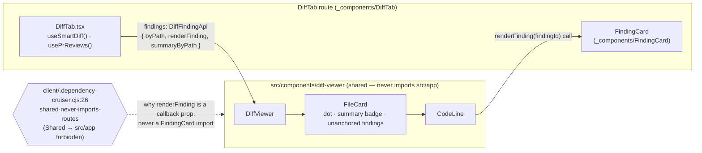

# Smart Diff — client part

> Introduced in: L03. Overview: [`docs/specs/smart-diff.md`](../../docs/specs/smart-diff.md).
> Refs are `path:line` (`symbol`) at the time of writing — if a line moved, search for the symbol.

## Goal
Render the Files-changed tab (`?tab=diff`) grouped by reviewer role with findings inline, without
ever blocking on the new endpoint, and without the shared `diff-viewer` importing route code.
This part: `useSmartDiff`/`useGenerateSummaries`, the `diff-viewer` render-prop injection point, and
the `DiffTab`/`DiffGroup` route components.

## Acceptance criteria

### Data hooks (`src/lib/hooks/core.ts`)
- [x] `useSmartDiff(prId)`: `GET /pulls/:id/smart-diff`, `queryKey: ["smart-diff", prId]`, `enabled: prId != null` — `client/src/lib/hooks/core.ts:124` · test: exercised indirectly via the mocked hook in `client/src/app/repos/[repoId]/pulls/[number]/_components/DiffTab/DiffTab.test.tsx:25`; no dedicated hook test
- [x] `useGenerateSummaries(prId)`: `POST /pulls/:id/smart-diff/summaries`, writes the response straight into the `["smart-diff", prId]` cache on success (no second round trip) — `client/src/lib/hooks/core.ts:138` (`useGenerateSummaries`), `client/src/lib/hooks/core.ts:142` (`onSuccess`) · test: `client/src/app/repos/[repoId]/pulls/[number]/_components/DiffTab/DiffTab.test.tsx:304` (button wiring only; the `setQueryData` cache-write itself is untested — the hook mock intercepts before it)

### `diff-viewer` render-prop boundary (`src/components/diff-viewer/`)
- [x] The shared `diff-viewer` never imports `FindingCard` — findings are injected as a render prop (`DiffFindingApi.renderFinding`), mirroring `DiffCommentApi` — `client/src/components/diff-viewer/findings.ts:17` (`DiffFindingApi`), `client/src/components/diff-viewer/CodeLine/CodeLine.tsx:78` (`renderFinding(a.id)`) · test: enforced by the architecture gate, not a unit test — `client/.dependency-cruiser.cjs:26` (`shared-never-imports-routes`), verified green as part of "`arch:check` 0 violations on both packages" (no per-rule regression test)
- [x] `anchorFindings` splits a file's anchors into ones matching a rendered line (`lineKey("RIGHT", line)`) and "unanchored" ones, mirroring `partitionThreads`'s outdated-comment policy — nothing is silently dropped — `client/src/components/diff-viewer/findings.ts:38` (`anchorFindings`) · test: `client/src/components/diff-viewer/findings.test.ts:6` ("matches an anchor whose line is rendered on the RIGHT side"), `client/src/components/diff-viewer/findings.test.ts:13` ("surfaces an anchor as unanchored when its line isn't in the rendered patch"), `client/src/components/diff-viewer/findings.test.ts:20` ("groups multiple anchors on the same line under one key")
- [x] `findingsForLine` resolves a parsed line's anchors via the same `lineKey` scheme threads use — `client/src/components/diff-viewer/findings.ts:58` (`findingsForLine`) · test: `client/src/components/diff-viewer/findings.test.ts:33`, `client/src/components/diff-viewer/findings.test.ts:38`, `client/src/components/diff-viewer/findings.test.ts:45`
- [x] `DiffViewer` keys each `FileCard` by `f.path`, not array index, so reordering into role groups doesn't carry one file's open/collapse or comment state onto a different file — `client/src/components/diff-viewer/DiffViewer/DiffViewer.tsx:31` (`key={f.path}`) · untested (no test reorders files and asserts per-file UI state survives correctly)
- [x] `FileCard` shows the dot indicator (`title`/`aria-label` "Has findings") beside the path when `findings.byPath` has an entry for that file, and renders unanchored findings at the top of the (open) file body — `client/src/components/diff-viewer/FileCard/FileCard.tsx:97` (dot), `client/src/components/diff-viewer/FileCard/FileCard.tsx:113` (unanchored block) · test: `client/src/app/repos/[repoId]/pulls/[number]/_components/DiffTab/DiffTab.test.tsx:259` ("shows the has-findings dot on the file, the finding card under its line, and wires Accept through useFindingAction")
- [x] `FileCard` shows a "✨ Summary" badge and a "What this does: …" line only when `summaryByPath` has an entry for that file's path — with `summaryByPath` empty/undefined the tab renders exactly as before step 8 — `client/src/components/diff-viewer/FileCard/FileCard.tsx:100`, `client/src/components/diff-viewer/FileCard/FileCard.tsx:112` · test: `client/src/app/repos/[repoId]/pulls/[number]/_components/DiffTab/DiffTab.test.tsx:284` ("renders with no summary badge or line when every pseudocode_summary is null"), `client/src/app/repos/[repoId]/pulls/[number]/_components/DiffTab/DiffTab.test.tsx:295` ("renders the summary badge and line for a file with a cached summary...")

### `DiffTab` / `DiffGroup` (`src/app/repos/[repoId]/pulls/[number]/_components/DiffTab/`)
- [x] `smartAvailable = !smartDiffLoading && !smartDiffError && !!smartDiff`; the toggle and both Smart-Diff-only buttons are hidden, and the tab falls back to the flat list, whenever the query hasn't resolved with confirmed data — including a stale-but-truthy background refetch (`isLoading`/`isError` true while `data` is still the previous page) — `client/src/app/repos/[repoId]/pulls/[number]/_components/DiffTab/DiffTab.tsx:38` (`smartAvailable`) · test: `client/src/app/repos/[repoId]/pulls/[number]/_components/DiffTab/DiffTab.test.tsx:173`, `:181`, `:193` ("still falls back to the flat list when stale Smart Diff data is loading again in the background"), `:202` ("...but the query is now erroring")
- [x] `order: "smart" | "original"` is local state; clicking the toggle button flips between the grouped and flat views and swaps its own label — `client/src/app/repos/[repoId]/pulls/[number]/_components/DiffTab/DiffTab.tsx:35`, `:126`-`:134` · test: `client/src/app/repos/[repoId]/pulls/[number]/_components/DiffTab/DiffTab.test.tsx:153` ("defaults to grouped Smart order and switches to the flat Original order on click")
- [x] `toPrFiles(group, files)` maps a Smart Diff group's files back to the `PrFile`s carrying the patch, in group order, dropping any that vanished from the diff — `client/src/app/repos/[repoId]/pulls/[number]/_components/DiffTab/helpers.ts:5` (`toPrFiles`) · test: `client/src/app/repos/[repoId]/pulls/[number]/_components/DiffTab/helpers.test.ts:8` ("maps a group's files back to the PrFile carrying the patch, in group order, dropping any that vanished from the diff")
- [x] `roleLabelKey(role)` → `` `${role}Label` `` — the `prReview.smartDiff.<role>Label` i18n key — `client/src/app/repos/[repoId]/pulls/[number]/_components/DiffTab/helpers.ts:15` (`roleLabelKey`) · test: `client/src/app/repos/[repoId]/pulls/[number]/_components/DiffTab/helpers.test.ts:23` ("appends Label to the role, matching the prReview.smartDiff copy keys")
- [x] The split-suggestion banner renders `largeTitle`/`largeBody`/one `<li>` per proposed split only when `split_suggestion.too_big` is true, and renders nothing otherwise — `client/src/app/repos/[repoId]/pulls/[number]/_components/DiffTab/DiffTab.tsx:170`-`:184` · test: `client/src/app/repos/[repoId]/pulls/[number]/_components/DiffTab/DiffTab.test.tsx:230`, `:251`
- [x] `DiffGroup` owns its own `open` state (defaults open, independent of individual `FileCard`s) and shows the "N files" / "N files with findings" summary ONLY while collapsed, never alongside the open children — `client/src/app/repos/[repoId]/pulls/[number]/_components/DiffTab/_components/DiffGroup/DiffGroup.tsx:29` (`open`), `:37`-`:44` (summary block) · test: `client/src/app/repos/[repoId]/pulls/[number]/_components/DiffTab/_components/DiffGroup/DiffGroup.test.tsx:31` (starts open), `:46` ("hides the summary while expanded, and shows both counts only once collapsed"), `:73` ("omits the findings-count fragment when nothing in the group has a finding")
- [x] `pathsWithFindings` (the set backing both `DiffGroup`'s collapsed count and `FileCard`'s dot) is derived once from `usePrReviews` in `DiffTab`, not recomputed per group from `finding_lines` — so the two counts can never disagree — `client/src/app/repos/[repoId]/pulls/[number]/_components/DiffTab/DiffTab.tsx:79` (`pathsWithFindings`) · untested directly (covered end-to-end by the DiffGroup and DiffTab dot tests above, but no test asserts the two counts specifically against each other from a shared source)

## Touched packages / modules
- `client/src/lib/hooks/core.ts` — `useSmartDiff`, `useGenerateSummaries`.
- `client/src/components/diff-viewer/findings.ts` (new) — `DiffFindingAnchor`, `DiffFindingApi`, `anchorFindings`, `findingsForLine`, `fs` styles.
- `client/src/components/diff-viewer/index.ts` — exports `DiffFindingAnchor`/`DiffFindingApi`.
- `client/src/components/diff-viewer/{DiffViewer,FileCard,CodeLine}` — `findings` prop threading, dot indicator, summary badge/line, unanchored findings block, `key={f.path}`.
- `client/src/app/repos/[repoId]/pulls/[number]/_components/DiffTab/` — `DiffTab.tsx`, `helpers.ts` (`toPrFiles`, `roleLabelKey`), `styles.ts`, `_components/DiffGroup/`.
- `client/src/app/repos/[repoId]/pulls/[number]/page.tsx:171` — passes files/props into `DiffTab` on `tab === "diff"`.
- `client/messages/en/{prReview,shell}.json` — `prReview.smartDiff.*` block, `shell.diffViewer.{hasFindings,summaryBadge,whatThisDoes}`.
- `client/src/vendor/shared/contracts/{brief,platform}.ts`.
- Other part: [`server/src/modules/pulls/docs/specs/smart-diff.md`](../../../server/src/modules/pulls/docs/specs/smart-diff.md).

## Client data flow: the render-prop boundary

## Open questions
- **No dedicated test exercises `useSmartDiff`/`useGenerateSummaries` against a real (mocked-fetch) query client** — every `DiffTab` test mocks the hook module itself (`client/src/app/repos/[repoId]/pulls/[number]/_components/DiffTab/DiffTab.test.tsx:25`), so the hooks' own `queryKey`/`enabled`/`onSuccess` wiring in `client/src/lib/hooks/core.ts` is unverified by an automated test — see the recorded, still-live insight that `client/AGENTS.md` claiming "fetch is mocked" is false (`client/docs/insights.md`, 2026-09-19 entry): there is no global fetch mock, so a hook-level integration test here would need its own `vi.mock`/MSW setup.
- **`DiffViewer`'s `key={f.path}` fix (replacing `key={i}`) has no test that actually reorders files and asserts per-file UI state (open/collapsed, comment draft) survives correctly** — `client/src/components/diff-viewer/DiffViewer/DiffViewer.tsx:31`.
- **The architecture boundary (`diff-viewer` never imports `FindingCard`) is enforced only by `pnpm arch:check`, not by a unit test** — a future refactor that reintroduces the import would be caught by CI's `arch:check` step, not by `pnpm test`.
