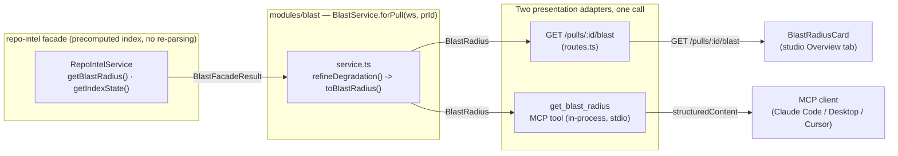

# Blast Radius

> Introduced in: L04. Refs are `path:line` (`symbol`) at the time of writing — if a line moved,
> search for the symbol.

## Goal

Tell a reviewer, before they approve a PR, which callers, HTTP endpoints and cron jobs the PR's
changed symbols can affect — read straight from repo-intel's precomputed index (no re-parsing, no
model call). The same answer is available two ways: the studio's Overview-tab card
(`GET /pulls/:id/blast`) and an MCP tool (`get_blast_radius`) an agent can call before reviewing or
approving a PR — both go through the same `BlastService.forPull`, so the two payloads are identical
by construction. A second, independent read (`GET /pulls/:id/prior-prs`, the `PriorPrs` panel) lists
merged PRs that previously touched the same files, fetched live from GitHub.

## Acceptance criteria

### Contract (`@devdigest/shared`, both copies)
- [x] `BlastDegradedReason = z.enum(['flag_off','index_failed','index_partial','repo_too_large','no_data'])`, `BlastCaller` gains optional `endpoints`/`crons`, `BlastRadius` gains optional `degraded`/`reason` — `server/src/vendor/shared/contracts/brief.ts:22` (`BlastDegradedReason`), `:38` (`BlastCaller`), `:56` (`BlastRadius`); byte-identical in `client/src/vendor/shared/contracts/brief.ts` · test: `server/test/contracts.test.ts:73` ("Intent / BlastRadius / Risks / PrHistory"), `server/test/contracts.test.ts:112` ("BlastRadius carries an optional degraded/reason, and BlastCaller an optional endpoints/crons")
- [x] `BlastRadiusResponse = BlastRadius`, `PrHistoryResponse = PrHistory` (route response schemas) — `server/src/vendor/shared/contracts/review-api.ts:102` (`BlastRadiusResponse`), `:106` (`PrHistoryResponse`); same in `client/src/vendor/shared/contracts/review-api.ts` · test: `server/test/contracts.test.ts:164` ("BlastRadiusResponse / PrHistoryResponse are BlastRadius / PrHistory (route response schemas)")

### Server route (`server/src/modules/blast/`)
- [x] `GET /pulls/:id/blast` reads the precomputed repo-intel index exactly once per call (evidenced by the `BLAST_READ_LOG` line) and never calls a model or GitHub — `server/src/modules/blast/routes.ts:21` (route), `server/src/modules/blast/service.ts:28` (`forPull`) · test: `server/test/blast-service.test.ts:53` ("calls getBlastRadius exactly once and logs the precomputed-read line"), `server/test/blast.it.test.ts:145` ("maps ≥2 real callers and ≥1 endpoint, puts the cron under crons_affected, and excludes the self-file caller")
- [x] `GET /pulls/:id/prior-prs` chases each of the PR's first `PRIOR_PRS_MAX_FILES` changed files' commit history on GitHub, dedupes the shas across files, and asks GitHub which merged PR(s) each belongs to — a GitHub failure throws `ExternalServiceError` rather than returning a partial list — `server/src/modules/blast/service.ts:48` (`priorPrs`), rate-limited `server/src/modules/blast/routes.ts:32` (`config.rateLimit {max:10,timeWindow:'1 minute'}`) · test: `server/test/blast-service.test.ts:77` ("dedupes PRs whose commits touch more than one changed file"), `server/test/blast-service.test.ts:100` ("a GitHub failure logs a warning and throws ExternalServiceError")
- [x] The facade's flat `callers[]` (one row per caller, pointing at `viaSymbol`) is grouped into the contract's `downstream[]` shape, dropping any caller whose file also declares the symbol it supposedly calls (the persistent repo-intel path does not drop this on its own) — `server/src/modules/blast/helpers.ts:22` (`toBlastRadius`) · test: `server/test/blast-mapping.test.ts:34` ("drops a caller whose file declares the symbol it supposedly calls (self-file exclusion)"), `server/test/blast.it.test.ts:145` (same, over a real Postgres index)
- [x] Index-state degradation is refined, not just passed through: `partial → index_partial`, `failed → index_failed`, read via a second `getIndexState()` call alongside `getBlastRadius()` — `server/src/modules/blast/helpers.ts:96` (`refineDegradation`), `server/src/modules/blast/service.ts:32` (`Promise.all`) · test: `server/test/blast-mapping.test.ts:141` ("partial index → index_partial, even though the facade itself said degraded:false"), `server/test/blast-mapping.test.ts:147` ("failed index → index_failed")
- [x] An unknown PR id 404s (`NotFoundError`), and a PR whose repo has no index state reports `degraded:true` — `server/src/modules/blast/service.ts:79` (`resolveContext`) · test: `server/test/blast.it.test.ts:169` ("404s for an unknown PR id"), `server/test/blast.it.test.ts:175` ("a second PR with no repo-intel index for its repo reports degraded:true")

### repo-intel fix: per-symbol caller cap
- [x] `MAX_CALLERS_PER_SYMBOL` caps callers PER `viaSymbol` (keeping rank order), not with one global slice over the whole rank-sorted list — on BOTH the persistent path and the ripgrep fallback, so a high-fan-out symbol can no longer starve every other changed symbol's callers — `server/src/modules/repo-intel/service.ts:382` (`tryPersistentBlast`, `cappedCallers`), `server/src/modules/repo-intel/service.ts:272` (`getBlastRadius`, ripgrep fallback, `countForSymbol`) · test: `server/test/repo-intel-blast-cap.test.ts:16` ("persistent index: 25 callers for symbol A + 3 for symbol B → 20 A + 3 B"), `server/test/repo-intel-blast-cap.test.ts:56` ("ripgrep fallback (no persistent index): same per-symbol cap applies")

### MCP (`server/src/mcp/`)
- [x] `get_blast_radius` is a real tool: it resolves the PR (`pr_id`, or `repo`+`number`, never both) and calls `modules/blast/compose.ts#makeBlastService(...).forPull` directly — the SAME call the HTTP route makes, so a Claude Code answer and the studio card's payload are identical by construction — `server/src/mcp/compose.ts:53` (`getBlastRadius`), `server/src/mcp/tools/get-blast-radius.ts:19` (`registerGetBlastRadius`) · test: `server/test/mcp-tools.test.ts:415` ("returns structuredContent matching the payload the route would return")
- [x] The `files` input field, declared for a future lesson but never read, was removed from `GetBlastRadiusInput` (D8) — `server/src/mcp/schemas.ts:137` (`GetBlastRadiusInput`) · test: `server/test/mcp-tools.test.ts:246` ("exposes exactly 5 bare-named, annotated tools")
- [x] A degraded result (index missing/partial) is returned normally, with its `reason`, never as `isError` — only an unresolvable PR reference is `isError` — `server/src/mcp/tools/get-blast-radius.ts:43` (`toToolError`) · test: `server/test/mcp-tools.test.ts:421` ("isError with a not-found hint for an unknown PR"), `server/test/mcp-tools.test.ts:428` ("isError when pr_id is given together with repo + number")

### Client (`client/src/app/repos/[repoId]/pulls/[number]/_components/BlastRadiusCard/`)
- [x] `useBlastRadius(prId)` (key `["blast", prId]`) and `usePriorPrs(prId, enabled)` (key `["prior-prs", prId]`, lazy — only fetches once the Prior PRs row is opened) — `client/src/lib/hooks/blast.ts:17` (`useBlastRadius`), `:28` (`usePriorPrs`) · test: exercised via the mocked hook in `client/src/app/repos/[repoId]/pulls/[number]/_components/BlastRadiusCard/BlastRadiusCard.test.tsx:20`; no dedicated hook-level test (see Open questions)
- [x] `BlastRadiusCard` renders a stats row (symbols/callers/endpoints/crons), a Tree/Graph toggle (`role="group"`, `aria-pressed`), `DegradedNotice` alongside the map whenever `degraded` is set, and a "no downstream" message when every changed symbol has zero callers — `client/src/app/repos/[repoId]/pulls/[number]/_components/BlastRadiusCard/BlastRadiusCard.tsx:58` · test: `client/src/app/repos/[repoId]/pulls/[number]/_components/BlastRadiusCard/BlastRadiusCard.test.tsx:50` ("renders the stats row over the Tree view by default, and switches to the Graph view on toggle"), `:82` ("shows the degraded notice with a working Resync button, and the no-callers message when the map is empty")
- [x] `useBlastResync` snapshots `lastIndexedSha`/`updatedAt`, fires the resync mutation, polls `useRepoIntelStatus` until the snapshot changes, invalidates `["blast", prId]`, and times out after `RESYNC_POLL_TIMEOUT_MS` (90s) — `client/src/lib/hooks/blast.ts:50` (`useBlastResync`) · test: exercised indirectly via `BlastRadiusCard.test.tsx:82` (the mocked `useBlastResync`'s `start` is called on click); the polling/timeout logic itself is untested (see Open questions)
- [x] The Tree view (`BlastTree`/`SymbolNode`) opens the first symbol by default, links each caller as a monospace `file:line` to its exact GitHub blob line, and renders endpoint/cron chips as distinct groups — `client/src/app/repos/[repoId]/pulls/[number]/_components/BlastRadiusCard/_components/BlastTree/BlastTree.tsx:17`, `_components/SymbolNode/SymbolNode.tsx:63` (`githubBlobUrl`) · test: `_components/BlastTree/BlastTree.test.tsx:30` ("opens the first symbol by default, links a caller to its exact GitHub blob line, and toggles on click"), `:49` ("renders endpoint and cron chips as distinct, separate groups"), `:55` ("renders callers as plain text, not a link, when repoFullName or headSha is missing")
- [x] The Graph view (`BlastGraph`/`helpers#layoutGraph`) is hand-written SVG with no charting dependency: three columns (symbols → distinct callers, deduped by `file:name` → per-caller endpoints/crons), cubic Bézier edges — `_components/BlastGraph/helpers.ts:42` (`layoutGraph`), `:108` (`edgePath`) · test: `_components/BlastGraph/helpers.test.ts:10` ("dedupes a caller shared by two changed symbols into one node with two edges, and only draws endpoint/cron edges from the specific caller that reaches them"), `:51`, `:61`
- [x] `PriorPrs` is a collapsible row, fetched lazily on open, listing merged PRs with title/author/merged date/notes, linking to GitHub, with an inline error that doesn't affect the tree/graph above it — `_components/PriorPrs/PriorPrs.tsx:12` · test: `_components/PriorPrs/PriorPrs.test.tsx:38` ("stays lazy until opened, then lists the merged PRs that touched these files"), `:68` ("shows an inline error without a link, and an empty state when there's nothing to show")
- [x] `OverviewTab` renders `BlastRadiusCard` after `IntentCard`, in a full-width grid row (`briefFull`, `gridColumn: "1 / -1"`); `page.tsx` passes `repoId`/`repoFullName` down — `client/src/app/repos/[repoId]/pulls/[number]/_components/OverviewTab/OverviewTab.tsx:32`, `_components/OverviewTab/styles.ts:11` (`briefFull`), `page.tsx:148` · untested directly (covered by the e2e flow below, not a unit test)

### e2e
- [x] `09-blast-radius.flow.json` lands on PR #482's Overview tab (default, no tab click) and confirms the card's title and the `reason.no_data` degraded text render, against the seed repo's un-indexed state; Prior PRs is left closed to avoid a live GitHub call — `e2e/specs/09-blast-radius.flow.json:1` · test: run via `npm run e2e:hermetic` (no dedicated unit test — this IS the test)

## Touched packages / modules
| Part | Code | Spec |
|---|---|---|
| Blast Radius module (route, service, mapping, prior-PRs) | `server/src/modules/blast/` | [`server/src/modules/blast/docs/specs/blast-radius.md`](../../server/src/modules/blast/docs/specs/blast-radius.md) |
| MCP `get_blast_radius` tool | `server/src/mcp/` | [`server/src/mcp/docs/specs/blast-radius.md`](../../server/src/mcp/docs/specs/blast-radius.md) |
| Per-symbol caller cap fix | `server/src/modules/repo-intel/service.ts` | [`server/src/modules/repo-intel/docs/specs/blast-radius.md`](../../server/src/modules/repo-intel/docs/specs/blast-radius.md) |
| GitHub port (`listCommitsForPath`/`listPullsForCommit`) | `server/src/adapters/github/octokit.ts`, `server/src/adapters/mocks.ts` | — (adapter change, no dedicated module spec) |
| Contract (`BlastDegradedReason`, `BlastCaller.endpoints/crons`, `BlastRadius.degraded/reason`, `BlastRadiusResponse`, `PrHistoryResponse`, `CommitPullRef`) | `server/src/vendor/shared/`, `client/src/vendor/shared/` (both copies) | both module parts above |
| Card, hooks, Tree/Graph views, Prior PRs panel | `client/src/app/repos/[repoId]/pulls/[number]/_components/BlastRadiusCard/`, `client/src/lib/hooks/blast.ts` | [`client/docs/specs/blast-radius.md`](../../client/docs/specs/blast-radius.md) |
| e2e flow | `e2e/specs/09-blast-radius.flow.json` | — (fixture + flow, no module spec) |

## Data flow: one facade, two presentation surfaces

## Open questions

- **No dedicated hook-level test exercises `useBlastRadius`/`usePriorPrs`/`useBlastResync` against a real (mocked-fetch) query client** — every card/component test mocks `../../../../../../../lib/hooks/blast` directly (`client/src/app/repos/[repoId]/pulls/[number]/_components/BlastRadiusCard/BlastRadiusCard.test.tsx:20`), so the hooks' own `queryKey`/`enabled`/polling/timeout wiring in `client/src/lib/hooks/blast.ts` is unverified by an automated test — same pattern already recorded for Smart Diff (`docs/specs/smart-diff.md`).
- **`flag_off` and `repo_too_large` are declared in `BlastDegradedReason` but never emitted by the facade today** — `server/src/modules/repo-intel/service.ts:220` (`getBlastRadius`) only reaches `no_data`, `index_partial` or `index_failed`; both other values pass through faithfully if the facade ever starts emitting them, but are unreachable now (`server/src/modules/blast/docs/insights.md`, 2026-09-28 entry).
- **`OverviewTab`'s `repoId`/`repoFullName` wiring and `briefFull` layout have no unit test** — covered only by the e2e flow (`e2e/specs/09-blast-radius.flow.json`), not a `OverviewTab.test.tsx`.
