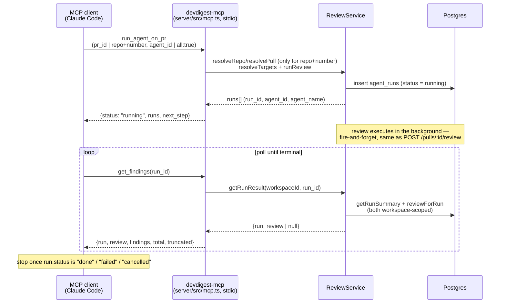

# devdigest-mcp

> Introduced in: L04. Refs are `path:line` (`symbol`) at the time of writing — if a line moved,
> search for the symbol.

## Goal

Expose the studio's core review workflow to an MCP client (Claude Code /
Desktop / Cursor) so an agent working in a codebase can, without leaving its
own session: list the configured review agents, start a review on a PR, poll
that run's findings, and read a repo's accepted conventions. **Stdio transport
only** — no HTTP step is added; the server runs in-process against the
existing application services, the same way `app.ts` does for the REST API.

`README.md:85` scheduled this server for L04 under the name `devdigest-mcp`;
before this lesson nothing MCP-related existed in the repo.

## User decisions (fixed, not open questions)

- **Transport: stdio only.** No `StreamableHttpServerTransport`, no second
  network port.
- **PR/repo resolver: local-DB only.** `repo:"owner/name"` + `number` resolves
  against the studio's own database; it never talks to GitHub. An unimported
  repo/PR 404s rather than triggering a sync.
- **Bare tool names** (`list_agents`, not `devdigest__list_agents`) — the MCP
  client namespaces them (Claude Code shows `mcp__devdigest__list_agents`),
  per the server key in `.mcp.json`.
- **`run_agent_on_pr` requires an explicit target**: `agent_id` XOR `all:true`.
  No implicit "run whatever's enabled" default.

## Tools

| Tool | Reads/writes | Notes |
|---|---|---|
| `list_agents` | read-only | `Agent[]`, concise (no prompt/schema) by default |
| `run_agent_on_pr` | starts a background run | not read-only, not idempotent, `openWorldHint` (spends LLM budget) |
| `get_findings` | read-only | doubles as the poll target for `run_agent_on_pr`; a failed/cancelled run is returned normally, never as a tool error |
| `get_conventions` | read-only | a repo's house rules, filterable by status |
| `get_blast_radius` | read-only | which callers, HTTP endpoints and crons a PR's changed symbols can affect — calls `modules/blast/compose.ts#makeBlastService(...).forPull`, the same call `GET /pulls/:id/blast` makes; a degraded result is returned normally, not as an error (implemented in L04, see [`docs/specs/blast-radius.md`](blast-radius.md)) |

## Data / call flow

## `get_blast_radius`: why it was a stub, and how the real implementation landed

An empty `BlastRadius` (`changed_symbols: [], downstream: [], summary: ""`)
reads as "nothing is affected" — a dangerous false negative for a caller
deciding how carefully to review a change. The L04 stub therefore answered
`isError: true` with an explicit "not implemented, do not read this as no
impact" message rather than an empty result, while declaring the final output
schema (`BlastRadius`, `contracts/brief.ts`) up front so a later lesson could
swap only the handler, not the tool's contract.

That later lesson is this one: `get_blast_radius` now calls
`modules/blast/compose.ts#makeBlastService(...).forPull` — the exact call
`GET /pulls/:id/blast` makes — so a Claude Code answer and the studio card's
payload are identical by construction. The same false-negative concern now
resolves differently: a DEGRADED result (index missing/partial) is returned
NORMALLY, with its `reason`, not as `isError` — an empty map here means "the
index can't answer yet", never "nothing is affected". Only an unresolvable PR
reference is `isError`. The `files` input declared in the stub was removed —
it was never read by any handler (D8). Full detail:
[`docs/specs/blast-radius.md`](blast-radius.md).

## Acceptance criteria

- [x] The server connects over stdio only, registers exactly 5 bare-named tools, and never calls `reapStaleRuns` on boot (that would reap a live API instance's in-flight runs out from under it) — `server/src/mcp.ts:1`, `server/src/mcp/server.ts:14` (`createDevDigestMcpServer`) · test: `server/test/mcp-tools.test.ts` ("exposes exactly 5 bare-named, annotated tools") · manual: piping `initialize`+`tools/list` into `pnpm --silent --dir server mcp` — stdout is exactly the 2 JSON-RPC response lines, 5 tools listed
- [x] `run_agent_on_pr`'s `repo`+`number` branch resolves LOCALLY only (workspace-scoped SQL, case-insensitive), never syncing with GitHub — `server/src/modules/pulls/service.ts:56` (`resolveRepo`), `:75` (`resolvePull`) · test: `server/test/pulls-resolve.test.ts` · `server/test/mcp.it.test.ts` ("runs an agent by repo/number...")
- [x] `run_agent_on_pr` requires `agent_id` XOR `all:true`, and `pr_id` XOR `repo`+`number` — either combination missing or doubled is `isError` with an actionable message — `server/src/mcp/helpers.ts:17` (`parsePrRef`), `:34` (`parseAgentSelection`) · test: `server/test/mcp-helpers.test.ts`, `server/test/mcp-tools.test.ts` (`describe('run_agent_on_pr')`)
- [x] `get_findings` is the poll target: workspace-scoped end to end, and a failed/cancelled run is returned normally (never `isError`) — `server/src/modules/reviews/service.ts:198` (`getRunResult`) · test: `server/test/mcp.it.test.ts` (poll-to-done, and the cross-workspace `isError` case)
- [x] `get_conventions` filters by status (default `accepted`) while `counts` always covers every status — `server/src/mcp/helpers.ts:71` (`filterByStatus`), `:80` (`countByStatus`) · test: `server/test/mcp.it.test.ts` ("get_conventions filters by status...")
- [x] `get_blast_radius` calls `modules/blast/compose.ts#makeBlastService(...).forPull`, returning the same `BlastRadius` payload `GET /pulls/:id/blast` returns as `structuredContent`; a degraded result is returned normally (not `isError`), and the stub-era `files` input was removed (D8) — `server/src/mcp/tools/get-blast-radius.ts:19` · test: `server/test/mcp-tools.test.ts` (`describe('get_blast_radius')`, 3 cases) · full detail: [`docs/specs/blast-radius.md`](blast-radius.md)
- [x] `.mcp.json` registers the server as `stdio`, running `pnpm --silent --dir server mcp` from the repo root (`--silent` keeps pnpm's own banner off stdout; no secrets in the config — the server reads `~/.devdigest/secrets.json` itself) — `.mcp.json:1`
- [x] 4 `pnpm arch:check` rules keep this a thin presentation adapter, same discipline as `app.ts` for HTTP — `server/.dependency-cruiser.cjs` (search `mcp-`) · verified: `pnpm arch:check` — 0 new violations
- [ ] An actual Claude Code session has exercised `.mcp.json` end to end (`/mcp` panel shows `devdigest` with 5 tools; a real `run_agent_on_pr` → `get_findings` round trip from the client) — needs a Claude Code restart outside this session's reach; the server side is proven by `server/test/mcp.it.test.ts` and the manual JSON-RPC smoke test instead

## Known limitations of stdio-only (documented, accepted)

- Runs execute **inside the MCP process** — they end when the client closes
  the session (bounded drain up to `MCP_DRAIN_MS`, then `cancelled`), unlike a
  REST-triggered run, which outlives the request that started it.
- `runBus` (`server/src/platform/sse.ts`) is per-process: the studio's Live Log
  never shows an MCP-started run, and a studio "cancel" can't reach one.
- An API restart reaps `agent_runs` still `running` (`server/src/app.ts:78-81`)
  — an in-flight MCP run gets marked `failed`, then the MCP process's own
  `completeAgentRun` (which has no status guard) can overwrite it back to
  `done` moments later.
- MCP calls bypass the REST rate limit on `POST /pulls/:id/review` (10/min);
  mitigated by requiring an explicit `agent_id`/`all:true` (no accidental
  fan-out) and by Claude Code's own per-tool-call approval.
- Finding text (title, rationale, file paths) is PR-derived, untrusted content
  handed straight to whatever model is on the other end of the MCP
  connection — the same trust boundary `reviewer-core`'s `INJECTION_GUARD`
  defends inside a review prompt, now facing outward.

## Touched packages / modules

| Part | Code | Spec |
|---|---|---|
| Tools, ports, compose, entrypoint | `server/src/mcp/`, `server/src/mcp.ts` | [`server/src/mcp/docs/specs/devdigest-mcp.md`](../../server/src/mcp/docs/specs/devdigest-mcp.md) |
| PR/repo resolver | `server/src/modules/pulls/` | [`server/src/modules/pulls/docs/specs/devdigest-mcp.md`](../../server/src/modules/pulls/docs/specs/devdigest-mcp.md) |
| Workspace-scoped run result | `server/src/modules/reviews/` | [`server/src/modules/reviews/docs/specs/devdigest-mcp.md`](../../server/src/modules/reviews/docs/specs/devdigest-mcp.md) |
| `get_blast_radius`'s real implementation (L04) | `server/src/modules/blast/` | [`docs/specs/blast-radius.md`](blast-radius.md) |
| Client registration | `.mcp.json` | — (no code, config only) |

## Open questions

- **No live MCP client has exercised this yet.** See the last (unchecked) acceptance criterion above — everything is proven from the server side (integration test + manual JSON-RPC smoke test), nothing from an actual `claude mcp` session.
- **`get_blast_radius` is now implemented** (see the acceptance criterion above and [`docs/specs/blast-radius.md`](blast-radius.md)); no test drives it through a DEGRADED (not-`isError`) result specifically — see that spec's Open questions.
