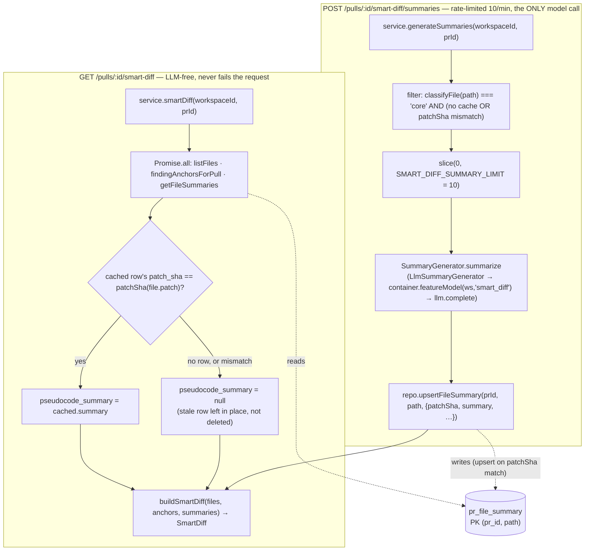
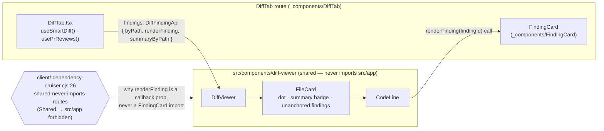

# Smart Diff — Files changed tab

> Introduced in: L03 (`README.md:84` — "Intent layer · Smart Diff"; the Intent half shipped earlier
> on this branch, Smart Diff is the other half). Refs are `path:line` (`symbol`) at the time of
> writing — if a line moved, search for the symbol.

## Goal
Give a reviewer a "Files changed" tab (`?tab=diff`) that groups files by reviewer role in reading
order instead of GitHub's flat list, and surfaces review findings inline — so a reviewer can start
at the top and stop once the signal runs out, instead of switching to the Agent runs tab and
mentally joining `file:line` back to the diff.

## Acceptance criteria

### Rule 1 — role ordering
- [x] Files are grouped into `core → tests → wiring → docs → boilerplate`, empty groups omitted, input order preserved inside a group — `server/src/modules/pulls/helpers.ts:281` (`buildSmartDiff`), `server/src/modules/pulls/constants.ts:18` (`ROLE_ORDER`) · test: `server/test/pulls-smart-diff.test.ts:55` ("buckets by role, in ROLE_ORDER, omitting empty groups"), `server/test/pulls-smart-diff.test.ts:64` ("preserves input order within a group")
- [x] Classification is first-match-wins over an ordered rule table (boilerplate → tests → wiring → docs, `core` fallback), matching whole path segments, never substrings — `server/src/modules/pulls/helpers.ts:216` (`classifyFile`), `server/src/modules/pulls/helpers.ts:181` (`RULES`), `server/src/modules/pulls/helpers.ts:144` (`hasSegment`) · test: `server/test/pulls-smart-diff.test.ts:12` (`classifyFile` table)
- [x] Three ordering-sensitive cases are pinned: `__snapshots__/x.snap` inside `__tests__` → `boilerplate`; `.claude/skills/security/SKILL.md` → `wiring`; `e2e/README.md` → `tests` — `server/src/modules/pulls/helpers.ts:181` (`RULES` order) · test: `server/test/pulls-smart-diff.test.ts:15`, `:16`, `:17`
- [x] Segment-vs-substring guard: `.claude/skills/react-testing-library/SKILL.md` → `wiring` (its `.claude` segment), not `tests` — `server/src/modules/pulls/helpers.ts:144` (`hasSegment`) · test: `server/test/pulls-smart-diff.test.ts:20`
- [x] `src/config.ts` stays `core` — the `*.config.*` wiring pattern requires a segment before `.config.` — `server/src/modules/pulls/helpers.ts:159` (`WIRING_CONFIG_FILE_RE`) · test: `server/test/pulls-smart-diff.test.ts:41`
- [x] `ROLE_ORDER` matches `SmartDiffRole.options` exactly — `server/src/modules/pulls/constants.ts:18` · test: `server/test/contracts.test.ts:132` ("SmartDiffRole reading order (Rule 1: core → tests → wiring → docs → boilerplate)")
- [x] The client trusts the server's group array as-is — it neither re-sorts groups nor synthesizes empty ones for roles the response omitted — `client/src/app/repos/[repoId]/pulls/[number]/_components/DiffTab/DiffTab.tsx:185` · test: `client/src/app/repos/[repoId]/pulls/[number]/_components/DiffTab/DiffTab.test.tsx:213` ("renders only the groups Smart Diff returned, in the order given, without reordering or backfilling missing roles")

### Rule 2 — findings in the diff
- [x] A collapsed group header shows "N files" plus, when present, how many of those files carry findings — `client/src/app/repos/[repoId]/pulls/[number]/_components/DiffTab/_components/DiffGroup/DiffGroup.tsx:38` · test: `client/src/app/repos/[repoId]/pulls/[number]/_components/DiffTab/_components/DiffGroup/DiffGroup.test.tsx:46` ("hides the summary while expanded, and shows both counts only once collapsed")
- [x] A file card shows a dot indicator when it has at least one finding — `client/src/components/diff-viewer/FileCard/FileCard.tsx:97` · test: `client/src/app/repos/[repoId]/pulls/[number]/_components/DiffTab/DiffTab.test.tsx:259` ("shows the has-findings dot on the file, the finding card under its line, and wires Accept through useFindingAction")
- [x] A finding renders under its code line (via `renderFinding`) and its Accept action calls `useFindingAction` with `{findingId, action: "accept", prId}`; the same card also exposes Dismiss — `client/src/components/diff-viewer/CodeLine/CodeLine.tsx:78`, `client/src/app/repos/[repoId]/pulls/[number]/_components/FindingCard/FindingCard.tsx:98` (`onAction("accept")`), `client/src/app/repos/[repoId]/pulls/[number]/_components/FindingCard/FindingCard.tsx:108` (`onAction("dismiss")`) · test: `client/src/app/repos/[repoId]/pulls/[number]/_components/DiffTab/DiffTab.test.tsx:259`
- [x] `finding_lines` (and the group/dot counts derived from them) are drawn from ALL of the PR's `kind: 'review'` runs, accepted and dismissed findings included — not just the latest review — `server/src/modules/pulls/repository.ts:180` (`findingAnchorsForPull`), `server/src/modules/pulls/domain.ts:110` (`FindingAnchor`) · untested (no integration test seeds two runs, one dismissed, and asserts the anchor still appears — see Open questions)
- [x] An anchor naming a path absent from the diff is dropped, not carried as a dangling entry — `server/src/modules/pulls/helpers.ts:254` (doc comment), `server/src/modules/pulls/helpers.ts:274` · test: `server/test/pulls-smart-diff.test.ts:84` ("drops anchors naming a path absent from the diff")

### Plus: order toggle, split banner, on-demand summaries
- [x] A Smart/Original order toggle (local state) falls back to the flat, GitHub-ordered list whenever the Smart Diff query is loading, errored, or has never resolved with data (including a stale-but-truthy background refetch) — `client/src/app/repos/[repoId]/pulls/[number]/_components/DiffTab/DiffTab.tsx:38` (`smartAvailable`) · test: `client/src/app/repos/[repoId]/pulls/[number]/_components/DiffTab/DiffTab.test.tsx:153`, `:173`, `:181`, `:193`, `:202`
- [x] A `split_suggestion` banner renders when the PR is flagged too big (`total_lines > SMART_DIFF_LARGE_LINES` = 500, a strict `>`), listing one proposed split per non-empty group — `server/src/modules/pulls/helpers.ts:287` (`tooBig`), `server/src/modules/pulls/constants.ts:21` (`SMART_DIFF_LARGE_LINES`), `client/src/app/repos/[repoId]/pulls/[number]/_components/DiffTab/DiffTab.tsx:170` · test: `server/test/pulls-smart-diff.test.ts:102` ("too_big is false exactly at the SMART_DIFF_LARGE_LINES threshold"), `server/test/pulls-smart-diff.test.ts:111` ("flags too_big above SMART_DIFF_LARGE_LINES and proposes one split per non-empty group"), `client/src/app/repos/[repoId]/pulls/[number]/_components/DiffTab/DiffTab.test.tsx:230` ("renders the large-PR banner with the proposed splits when the PR is flagged too big"), `client/src/app/repos/[repoId]/pulls/[number]/_components/DiffTab/DiffTab.test.tsx:251` ("renders no banner when the PR isn't flagged too big")
- [x] `GET /pulls/:id/smart-diff` never calls a model — every `pseudocode_summary` is `null` until a `POST` fills the cache — `server/src/modules/pulls/service.ts:131` (`smartDiff`) · test: `server/test/pulls-smart-diff-summaries.it.test.ts:77` ("GET never calls a model: every pseudocode_summary is null before any POST")
- [x] `POST /pulls/:id/smart-diff/summaries` is button-triggered only (never called from `useSmartDiff` or on mount), summarises only uncached `core`-group files, and writes the response straight into the `["smart-diff", prId]` query cache — `client/src/lib/hooks/core.ts:138` (`useGenerateSummaries`), `server/src/modules/pulls/service.ts:151` (`generateSummaries`) · test: `server/test/pulls-smart-diff-summaries.it.test.ts:88` ("POST summarises only the uncached core-group file; GET then serves it from cache")
- [x] A cached summary survives a `replaceFiles` refresh with the same patch, and goes stale (served `null`, row not deleted) when the patch changes — `server/src/modules/pulls/helpers.ts:239` (`resolveSummary`), `server/src/modules/pulls/helpers.ts:229` (`patchSha`) · test: `server/test/pulls-smart-diff-summaries.it.test.ts:116` ("a cached summary survives a replaceFiles refresh with the same patch, and goes stale when the patch changes")
- [x] `POST` is rate-limited (10/min) and capped at `SMART_DIFF_SUMMARY_LIMIT` = 10 files per call — `server/src/modules/pulls/routes.ts:56` (`config.rateLimit`), `server/src/modules/pulls/service.ts:164` (`.slice(0, SMART_DIFF_SUMMARY_LIMIT)`) · untested (no test drives more than one target file or exceeds the rate limit — see Open questions)
- [x] `pseudocode_summary` shows as a "✨ Summary" badge plus a "What this does: …" line only for files with a still-valid cached summary; with no cache entries at all the tab renders exactly as before this step — `client/src/components/diff-viewer/FileCard/FileCard.tsx:100`, `client/src/components/diff-viewer/FileCard/FileCard.tsx:112` · test: `client/src/app/repos/[repoId]/pulls/[number]/_components/DiffTab/DiffTab.test.tsx:284` ("renders with no summary badge or line when every pseudocode_summary is null"), `client/src/app/repos/[repoId]/pulls/[number]/_components/DiffTab/DiffTab.test.tsx:295` ("renders the summary badge and line for a file with a cached summary, and wires the Generate button")

## Touched packages / modules
| Part | Code | Spec |
|---|---|---|
| Role classifier, grouping, findings anchors, summary cache read/write, routes | `server/src/modules/pulls/{helpers,constants,domain,ports,compose,summary-prompt,repository,service,routes}.ts` | [`server/src/modules/pulls/docs/specs/smart-diff.md`](../../server/src/modules/pulls/docs/specs/smart-diff.md) |
| Contracts `SmartDiffRole` (widened to 5 roles), `FeatureModelId`/`FEATURE_MODELS` (`'smart_diff'`) | `server/src/vendor/shared/contracts/{brief,platform}.ts` + the byte-identical `client/src/vendor/shared/contracts/{brief,platform}.ts` copies | both module parts |
| DB: `pr_file_summary` table, composite PK `(pr_id, path)`, `patch_sha` invalidation key | `server/src/db/schema/pulls.ts:68`, migration `server/src/db/migrations/0016_perfect_madame_web.sql` | pulls part |
| Client: `useSmartDiff`/`useGenerateSummaries`, render-prop findings injection, grouped UI | `client/src/lib/hooks/core.ts`, `client/src/components/diff-viewer/{findings.ts,DiffViewer,FileCard,CodeLine}`, `client/src/app/repos/[repoId]/pulls/[number]/_components/DiffTab/**` | [`client/docs/specs/smart-diff.md`](../../client/docs/specs/smart-diff.md) |
| Seed + e2e | `server/src/db/seed.ts:128` (PR #482 widened across roles), `e2e/specs/08-smart-diff.flow.json` | — (fixture + flow, no module spec) |

## Request flow: both routes, including the `patch_sha` cache decision

## Client data flow: the render-prop boundary

`client/.dependency-cruiser.cjs:26` (`shared-never-imports-routes`, `from: ^src/(components|lib|vendor)/`, `to: ^src/app/`) forbids the shared `diff-viewer` from importing `FindingCard`, which lives under `src/app/…/_components/FindingCard/`. So `DiffTab` injects finding rendering as a callback, mirroring the existing `DiffCommentApi`:

## Open questions
- **`findingAnchorsForPull`'s "all runs, dismissed included" behaviour has no integration test** — the unit tests for `buildSmartDiff` (`server/test/pulls-smart-diff.test.ts:72`) only prove the grouping/dedup logic on anchors handed to it directly; nothing seeds a PR with two `kind: 'review'` runs (one with a dismissed finding) and asserts the anchor still reaches `finding_lines` — `server/src/modules/pulls/repository.ts:180`.
- **The `POST` rate limit (10/min) and the `SMART_DIFF_SUMMARY_LIMIT` = 10 cap are both config-only, untested** — every test drives at most one `core` file per call, so nothing exercises the `.slice(0, 10)` truncation or a 429 — `server/src/modules/pulls/routes.ts:56`, `server/src/modules/pulls/service.ts:164`.
- **Two `prReview.smartDiff` copy keys, `findingLines` and `groupedByRole`, are seeded but read by nothing** — `client/messages/en/prReview.json:74`, `:75` (`client/docs/insights.md`, 2026-09-25 entry). Not a contradiction with this spec (no acceptance criterion claims they're used), but a candidate for cleanup or for a not-yet-built surface.
