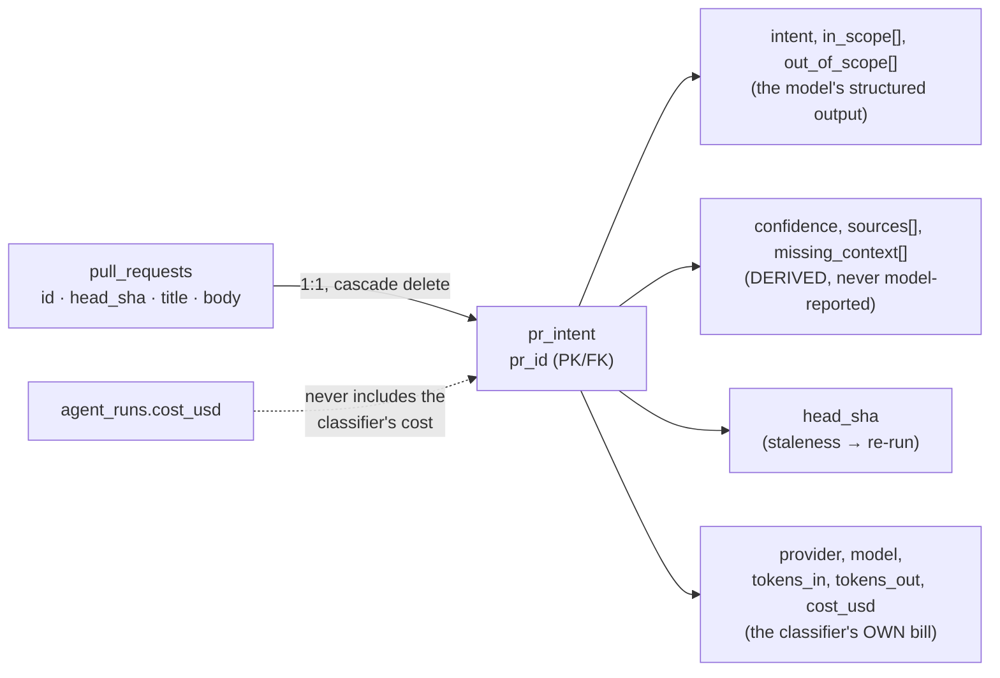

# Intent Layer

> Introduced in: L03. Refs are `path:line` (`symbol`) at the time of writing — if a line moved,
> search for the symbol.

## Goal
Derive a PR's intent and scope once, as shared pre-work ahead of the per-agent review loop, from deterministic internal sources only — never an outbound fetch — and persist it keyed by `head_sha` so a stale intent (force-push) is visibly re-derivable. See `docs/specs/intent-layer.md` for the project-wide picture.

## Data model

`pr_intent` is a single row per PR (primary key `pr_id`), all new columns nullable or defaulted so pre-existing rows keep parsing — `server/src/db/schema/reviews.ts:48` (`prIntent`), migration `server/src/db/migrations/0013_quiet_martin_li.sql`. It carries no `workspace_id` of its own — every read/write is scoped by joining through `pull_requests` (see routes below), the same gap already recorded for `/runs/:id/*` in `server/src/modules/reviews/docs/insights.md:29` (do not repeat it).

## Acceptance criteria
- [x] `GET /pulls/:id/intent` returns `PrIntentRecord | null`, resolved through `getPull(workspaceId, prId)` first so `pr_intent`'s missing `workspace_id` never leaks another workspace's row — `server/src/modules/reviews/routes.ts:135`, `server/src/modules/reviews/service.ts:197` (`getIntent`) · `server/test/intent.it.test.ts:154` (404s for a PR in another workspace)
- [x] `POST /pulls/:id/intent` re-classifies and upserts, rate-limited the same as `POST /pulls/:id/review` (10/min) — `server/src/modules/reviews/routes.ts:142`, `server/src/modules/reviews/service.ts:209` (`detectIntent`) · `server/test/intent.it.test.ts:172` (404s cross-workspace, writes no row), `:197` (empty body ⇒ `low`), `:225` (unreachable spec ⇒ `missing_context`)
- [x] `ReviewRunExecutor#deriveIntent` runs collect→classify→upsert once per run, shared across every queued agent via the fanned-out `RunLogger`, between the diff load and the per-agent loop; reuses the stored record when `stored.head_sha === pull.headSha`, re-derives otherwise — `server/src/modules/reviews/run-executor.ts:369` (`deriveIntent`) · untested
- [x] A classifier failure is best-effort — logged via `runLog.info`, the run continues with `intentText: undefined`; UNLIKE a diff-load failure it never calls `failAll` — `server/src/modules/reviews/run-executor.ts:428` (catch block) · untested (no integration test forces a classifier throw)
- [x] The collector+classifier pair is injected into `ReviewRunExecutor`'s constructor by `service.ts` (`makeIntentEngine`), never pulled off the `Container` inside the executor — keeps the LLM call out of the application ring — `server/src/modules/reviews/service.ts:42` (`makeIntentEngine(container, this.repo)`), `server/src/modules/reviews/run-executor.ts:61` (constructor param) · untested (structural; enforced by `pnpm arch:check`, not a unit test)
- [x] Sources are gathered deterministically: title (always), body (often empty), linked issue via `container.github().getIssue()` off a `#123`/`closes #123` regex on the PR body, a linked plan/spec resolved to a repo path and read via `container.git.readFile`, the diff's changed files + hunk headers (never hunk bodies), and this PR's commit messages — `server/src/modules/reviews/compose.ts:40` (`RepoIntentSourceCollector.collect`) · test: `server/test/reviews-intent-helpers.test.ts:129` ("matches a bare #123"), `server/test/reviews-intent-helpers.test.ts:149` ("finds a docs/specs/*.md path mentioned in the body")
- [x] Commit messages are read via a new `commitsForPull` query added to the **reviews** repository (not `pulls/repository.ts`) — `pulls` owns `pr_commits`, but `no-cross-module-imports` forbids reaching into another module's repository; a repository may read any table — `server/src/modules/reviews/repository/pull.repo.ts:115` (`commitsForPull`) · untested
- [x] Every source attempt is recorded (`{kind, ref, ok}`); an unresolved reference becomes a `missing_context[]` entry and is never invented — `server/src/modules/reviews/intent-helpers.ts:63` (`deriveMissingContext`) · test: `server/test/reviews-intent-helpers.test.ts:108` ("reports only failed attempts, with a readable message per kind")
- [x] `confidence` is derived, never model-reported: high when an issue or spec was actually read; medium when the body is ≥40 chars with no issue/spec; low otherwise; any referenced-source failure demotes one band — `server/src/modules/reviews/intent-helpers.ts:31` (`deriveConfidence`), `server/src/modules/reviews/constants.ts:26` (`MIN_BODY_CHARS_FOR_MEDIUM = 40`) · test: `server/test/reviews-intent-helpers.test.ts:62` ("never demotes low below low")
- [x] The classifier's model comes from the `review_intent` feature-model slot (`container.featureModel(ws, 'review_intent')`), defaulting to `openrouter`/`deepseek/deepseek-v4-flash` — `server/src/modules/reviews/compose.ts:113` (`LlmIntentClassifier.classify`) · untested
- [x] The classifier's own prompt wraps title/body/issue/spec (and, defense-in-depth, files/commits) in `<untrusted source="...">` and instructs the model never to invent an unavailable source — `server/src/modules/reviews/intent-prompt.ts:53` (`buildUserPrompt`) · test: `server/test/reviews-intent-sources.test.ts:98` ("wraps title, body, issue and spec in <untrusted> blocks")
- [x] The classifier's system prompt explicitly instructs the model to always answer in English, regardless of the language of the PR title, description, linked issue, or spec — sparse/foreign-language input (e.g. an empty PR body) could otherwise cause the default model (`openrouter`/`deepseek/deepseek-v4-flash`) to answer in Chinese, observed live on PR #7 — `server/src/modules/reviews/intent-prompt.ts:29` (`SYSTEM_PROMPT`) · test: `server/test/reviews-intent-sources.test.ts` (`describe('SYSTEM_PROMPT')`)
- [x] Diff bodies never reach the classifier — the collector's port type (`IntentDiffFiles`) structurally has no `.raw` field, unlike `UnifiedDiff` — `server/src/modules/reviews/ports.ts:51` (`IntentDiffFiles`) · test: `server/test/reviews-intent-sources.test.ts:89` ("never contains the raw diff text, however the sources were assembled")
- [x] The classifier's own tokens/cost persist to `pr_intent` (`tokens_in`, `tokens_out`, `cost_usd`), never into `agent_runs`, so per-agent cost stays honest — `server/src/modules/reviews/repository/pull.repo.ts:61` (`upsertIntent`), `server/src/db/schema/reviews.ts:67` · untested
- [x] `renderIntentForPrompt` turns a stored `PrIntentRecord` into the reviewer's `intent` prompt slot text: summary, in/out-of-scope bullets, and `missing_context` gaps so the reviewer sees where evidence was thin — `server/src/modules/reviews/intent-sources.ts:46` (`renderIntentForPrompt`) · test: `server/test/reviews-intent-sources.test.ts:174` ("includes missing_context so the reviewer sees the gaps too")
- [x] Observability: one `runLog.step('Deriving PR intent', ...)` fans the classifier out to the Live Log, `run_traces.log` and pino, distinct from each agent's own review step; logs provider/model, which source kinds resolved, per-part char counts, and real tokens/cost — never diff bodies or secrets — `server/src/modules/reviews/run-executor.ts:387` (`runLog.step`), `:410` (structured log line) · untested

## A dead mechanism — do not wire it up
`routeModel(task: 'intent')` in `server/src/platform/model-router.ts:27` is unused dead code (`TaskKind` includes `'intent'`, but nothing calls `routeModel` from this module or anywhere else). The live, actually-used mechanism is `container.featureModel(workspaceId, 'review_intent')` inside `LlmIntentClassifier.classify` (`compose.ts:113`). Do not wire `routeModel` up as a rival path.

## Touched packages / modules
| Part | Code | Spec |
|---|---|---|
| Prompt slot + out-of-scope filter | `reviewer-core/` | [`reviewer-core/docs/specs/intent-layer.md`](../../../../../reviewer-core/docs/specs/intent-layer.md) |
| UI | `client/` | [`client/docs/specs/intent-layer.md`](../../../../../client/docs/specs/intent-layer.md) |
| Overview + cross-package picture | — | [`docs/specs/intent-layer.md`](../../../../../docs/specs/intent-layer.md) |

## Open questions
- **The run-executor's intent step is untested, though the routes are.** `server/test/intent.it.test.ts` covers `GET`/`POST /pulls/:id/intent`, workspace scoping, the empty-body `low` band and the unreachable-spec `missing_context` path. What no test reaches is the executor side: the stale-`head_sha` re-derivation branch (`run-executor.ts:369`) and the classifier-failure best-effort path (`:428`). `server/test/reviews.it.test.ts` and `reviews-skills.it.test.ts` stub the classifier's structured response (`INTENT_FIXTURE`, `structuredBySchema: { pr_intent: ... }` — `reviews.it.test.ts:71`) only so the *existing* review-run assertions keep passing now that every run triggers a classifier call.
- **`domain-files-are-pure` does not actually check these "pure" files.** `intent-helpers.ts`/`intent-sources.ts`/`intent-prompt.ts` are pure by discipline, not by the `pnpm arch:check` gate — the rule's regex matches only the exact filenames `domain|ports|helpers|constants.ts`, so `intent-helpers.ts` is unmatched (`server/docs/insights.md:36`, corrected `:38`). `ports.ts` IS covered and must never import `Container`.
- **`pr_intent` has no `workspace_id`.** Both routes compensate by resolving the PR through `getPull(workspaceId, prId)` first; a future direct query against `pr_intent` (e.g. an admin/report endpoint) would need the same join, or it reopens the hole already flagged for `/runs/:id/*`.
